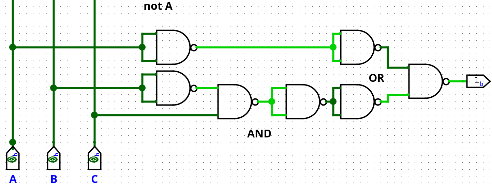

# Exercise 1:
Given a Boolean function, draw the equivalent minimum circuit:

## Given Function

F = Σ₃ m(1, 3, 5, 7)

This notation represents a Boolean function of **3 variables** expressed as the **sum (OR) of minterms**.

---

## Meaning of the Symbols

- **Σ (Sigma)**: logical OR of the listed minterms  
- **Subscript 3 (Σ₃)**: number of variables (A, B, C)  
- **m(i)**: minterm with index *i*  
- **Minterm**: a specific input combination for which the function output is **1**

---

## Variables

The function depends on three Boolean variables:

- **A**
- **B**
- **C**

---

## Truth Table

| A | B | C | F |
|---|---|---|---|
| 0 | 0 | 0 | 0 |
| 0 | 0 | 1 | 1 |
| 0 | 1 | 0 | 0 |
| 0 | 1 | 1 | 1 |
| 1 | 0 | 0 | 0 |
| 1 | 0 | 1 | 1 |
| 1 | 1 | 0 | 0 |
| 1 | 1 | 1 | 1 |

The output **F = 1** for minterms **1, 3, 5, and 7**.

---

## Observation

For all input combinations where **C = 1**, the output **F = 1**, regardless of the values of **A** and **B**.

---

## Minimal Boolean Expression

F = C

---
## Minimal Circuit


*Figure 1: Minimal logic circuit implementation.*


# Exercise 2:
Given a Boolean function, draw the equivalent minimum circuit:

## Given Function

F = Π₃ M(0, 3, 4, 5, 7)

This notation represents a Boolean function of **3 variables** expressed as the **product (AND) of maxterms**.

---

## Meaning of the Symbols

- **Π (Pi)**: logical AND of the listed maxterms  
- **Subscript 3 (Π₃)**: number of variables (A, B, C)  
- **M(i)**: maxterm with index *i*  
- **Maxterm**: a specific input combination for which the function output is **0**

---

## Variables

The function depends on three Boolean variables:

- **A**
- **B**
- **C**

---

## Truth Table

| A | B | C | F |
|---|---|---|---|
| 0 | 0 | 0 | 0 |
| 0 | 0 | 1 | 1 |
| 0 | 1 | 0 | 1 |
| 0 | 1 | 1 | 0 |
| 1 | 0 | 0 | 0 |
| 1 | 0 | 1 | 0 |
| 1 | 1 | 0 | 1 |
| 1 | 1 | 1 | 0 |

The output **F = 0** for maxterms **0, 3, 4, 5, 7**.
This truth table lists all possible input combinations and the corresponding value of the output F.

---

## Observation

Instead of starting from maxterms, I find it more intuitive to think  in reverse and focus directly on the
input combinations for which **F = 1**.

From the truth table, F is equal to 1 for the following input values:
- (A, B, C) = (0, 0, 1)
- (A, B, C) = (0, 1, 0)
- (A, B, C) = (1, 1, 0)

---

## Minimal Boolean Expression

F = (A̅ · B̅ · C) + (B · C̅)

### How I obtained this expression

1. **Start from the truth table**  
   I started from the truth table considering the values for which the output was 1
   (corresponding to minterms 1, 2, and 6).

   - A B C = 001
   - A B C = 110

2. **Write the Sum of Products (SOP)**  
   Each row where F = 1 becomes a minterm:

   F = (!A · !B · C) + (!A · B · !C) + (A · B · !C)

3. **Factor common terms**  
   Group the last two terms:

   (!A · B · !C) + (A · B · !C)  
   = B · !C · (!A + A)

4. **Apply Boolean identities**  
   We know that:

   (!A + A) = 1  

   Therefore:

   B · !C · 1 = B · !C  

   (If it is not immediately obvious, try building a truth table for this part only.)

5. **Final minimal form**  
   Each combination where F = 1 is translated into a product term.
   The final Boolean function is obtained by OR-ing all these product terms and then simplifying.

   **F = (!A · !B · C) + (B · !C)**
---
## Minimal Circuit


*Figure 1: Minimal logic circuit implementation.*

# Exercise 3 – Boolean Function Simplification (SOP using Karnaugh Map)

## Problem Statement

Given a Boolean function of four variables:

f(x, y, z, w)

The function is provided through its truth table (implicitly represented via a Karnaugh map).

**Tasks:**
1. Simplify the function using the **Sum of Products (SOP)** method.
2. Obtain the minimal Boolean expression.
3. Implement the simplified function as a logic circuit.

---

## Given Data

### Karnaugh Map Layout

- Rows: `xy = 00, 01, 11, 10` (Gray code)
- Columns: `zw = 00, 01, 11, 10` (Gray code)

### Karnaugh Map Values

```
          zw
        00  01  11  10
      ┌────────────────
xy 00 │  0   1   1   0
   01 │  0   1   1   0
   11 │  1   1   0   0
   10 │  1   1   0   0

```

---

## Solution Strategy

Since the required form is **SOP (Sum of Products)**:

- Group **1s** in the Karnaugh map.
- Each group produces a **product term (AND)**.
- The final function is the **OR** of all product terms.
- A variable:
  - Constant **1** → appears uncomplemented
  - Constant **0** → appears complemented
  - Changing → eliminated

---

## Karnaugh Grouping

### Group 1 (Upper 2×2 block)

Cells:
- `xy = 00, 01`
- `zw = 01, 11`

Constant variables:
- `x = 0` → ¬x
- `w = 1` → w

Changing variables:
- y, z → eliminated

**Product term:**
```
¬x · w
```

---

### Group 2 (Lower 2×2 block)

Cells:
- `xy = 11, 10`
- `zw = 00, 01`

Constant variables:
- `x = 1` → x
- `z = 0` → ¬z

Changing variables:
- y, w → eliminated

**Product term:**
```
x · ¬z
```

---

## Final Simplified SOP Expression

```
f(x, y, z, w) = (¬x · w) + (x · ¬z)
```

This is the minimal SOP form obtained from the Karnaugh map.

---

## Verification

The simplified function was implemented in **Logisim**, and the generated truth table matches the Karnaugh map values exactly.

---

## Circuit Implementation

### Final Logic Circuit


# Exercise 4 – Karnaugh Map Analysis and NAND Implementation

## Problem Statement

Given the Karnaugh map:

1. Analyze it.
2. Find the simplified Boolean function.
3. Draw the simplified logic diagram.
4. Implement the same function using **only NAND gates**.

---

### Karnaugh Map

The Karnaugh map uses the following layout:

- Variables **A B** on the horizontal axis 
- Variable **C** on the vertical axis

| C \ AB | 00 | 01 | 11 | 10 |
|------|----|----|----|----|
| 0    | 1  | 1  | 0  | 0  |
| 1    | 1  | 1  | 0  | 1  |

From the map we can see:

- The function is **1 for all cases where A = 0**
- The function is also **1 when B = 0 and C = 1**

---

### Boolean Function

By grouping the 1s in the Karnaugh map, the simplified Boolean function is:

F = NOT A OR (NOT B AND C)

---

### Simplified Logic Diagram

The simplified logic requires:

- a NOT gate for A
- a NOT gate for B
- an AND gate for (NOT B AND C)
- an OR gate to combine the two terms


---

### NAND Gate Implementation (Explanation)

The NAND gate is a **universal gate**, meaning that any logic function can be implemented using only NAND gates.

I used the following transformations:

- NOT X (self-connected) here NAND is used as inverter
  X NAND X

- X AND Y  
  (X NAND Y) NAND (X NAND Y)

- X OR Y  
  (X NAND X) NAND (Y NAND Y)

Using these rules, every NOT, AND and OR gate in the simplified logic diagram can be replaced by NAND gates only.

---

### NAND-Only Circuit

The final circuit implements the same Boolean function using **only NAND gates**.




