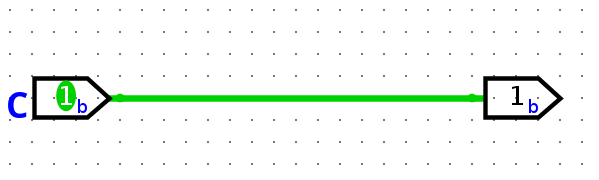
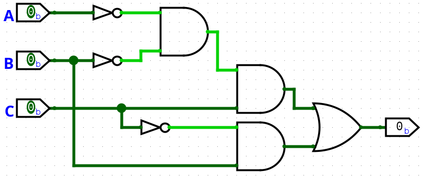

# Exercise 1:
Given a Boolean function, draw the equivalent minimum circuit:

## Given Function

F = Σ₃ m(1, 3, 5, 7)

This notation represents a Boolean function of **3 variables** expressed as the **sum (OR) of minterms**.

---

## Meaning of the Symbols

- **Σ (Sigma)**: logical OR of the listed minterms  
- **Subscript 3 (Σ₃)**: number of variables (A, B, C)  
- **m(i)**: minterm with index *i*  
- **Minterm**: a specific input combination for which the function output is **1**

---

## Variables

The function depends on three Boolean variables:

- **A**
- **B**
- **C**

---

## Truth Table

| A | B | C | F |
|---|---|---|---|
| 0 | 0 | 0 | 0 |
| 0 | 0 | 1 | 1 |
| 0 | 1 | 0 | 0 |
| 0 | 1 | 1 | 1 |
| 1 | 0 | 0 | 0 |
| 1 | 0 | 1 | 1 |
| 1 | 1 | 0 | 0 |
| 1 | 1 | 1 | 1 |

The output **F = 1** for minterms **1, 3, 5, and 7**.

---

## Observation

For all input combinations where **C = 1**, the output **F = 1**, regardless of the values of **A** and **B**.

---

## Minimal Boolean Expression

F = C

---
## Minimal Circuit

*Figure 1: Minimal logic circuit implementation.*

# Exercise 2:
Given a Boolean function, draw the equivalent minimum circuit:

## Given Function

F = Π₃ M(0, 3, 4, 5, 7)

This notation represents a Boolean function of **3 variables** expressed as the **product (AND) of maxterms**.

---

## Meaning of the Symbols

- **Π (Pi)**: logical AND of the listed maxterms  
- **Subscript 3 (Π₃)**: number of variables (A, B, C)  
- **M(i)**: maxterm with index *i*  
- **Maxterm**: a specific input combination for which the function output is **0**

---

## Variables

The function depends on three Boolean variables:

- **A**
- **B**
- **C**

---

## Truth Table

| A | B | C | F |
|---|---|---|---|
| 0 | 0 | 0 | 0 |
| 0 | 0 | 1 | 1 |
| 0 | 1 | 0 | 1 |
| 0 | 1 | 1 | 0 |
| 1 | 0 | 0 | 0 |
| 1 | 0 | 1 | 0 |
| 1 | 1 | 0 | 1 |
| 1 | 1 | 1 | 0 |

The output **F = 0** for maxterms **0, 3, 4, 5, 7**.
This truth table lists all possible input combinations and the corresponding value of the output F.

---

## Observation

Instead of starting from maxterms, I find it more intuitive to think  in reverse and focus directly on the
input combinations for which **F = 1**.

From the truth table, F is equal to 1 for the following input values:
- (A, B, C) = (0, 0, 1)
- (A, B, C) = (0, 1, 0)
- (A, B, C) = (1, 1, 0)

---

## Minimal Boolean Expression

F = (A̅ · B̅ · C) + (B · C̅)

### How I obtained this expression

1. **Start from the truth table**  
   I started from the truth table considering the values for which the output was 1
   (corresponding to minterms 1, 2, and 6).

   - A B C = 001
   - A B C = 110

2. **Write the Sum of Products (SOP)**  
   Each row where F = 1 becomes a minterm:

   F = (!A · !B · C) + (!A · B · !C) + (A · B · !C)

3. **Factor common terms**  
   Group the last two terms:

   (!A · B · !C) + (A · B · !C)  
   = B · !C · (!A + A)

4. **Apply Boolean identities**  
   We know that:

   (!A + A) = 1  

   Therefore:

   B · !C · 1 = B · !C  

   (If it is not immediately obvious, try building a truth table for this part only.)

5. **Final minimal form**  
   Each combination where F = 1 is translated into a product term.
   The final Boolean function is obtained by OR-ing all these product terms and then simplifying.

   **F = (!A · !B · C) + (B · !C)**
---
## Minimal Circuit

*Figure 1: Minimal logic circuit implementation.*
