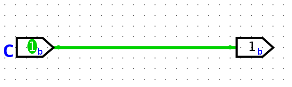
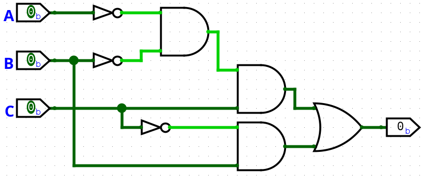
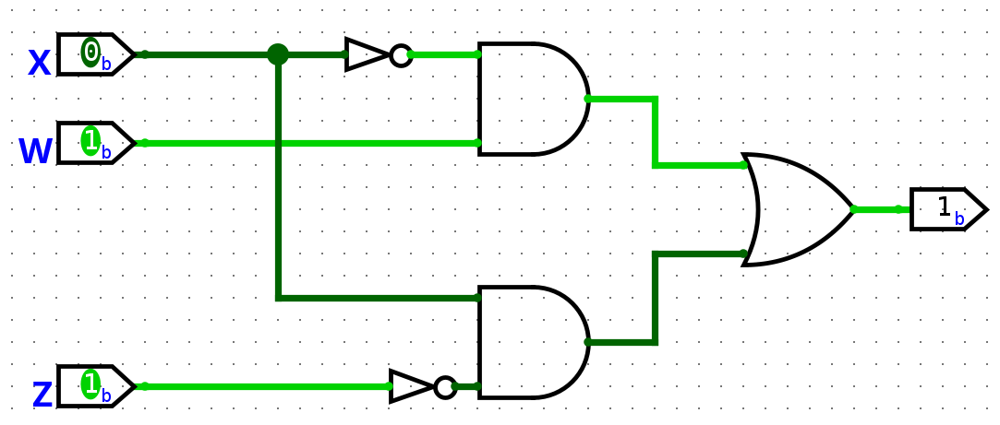
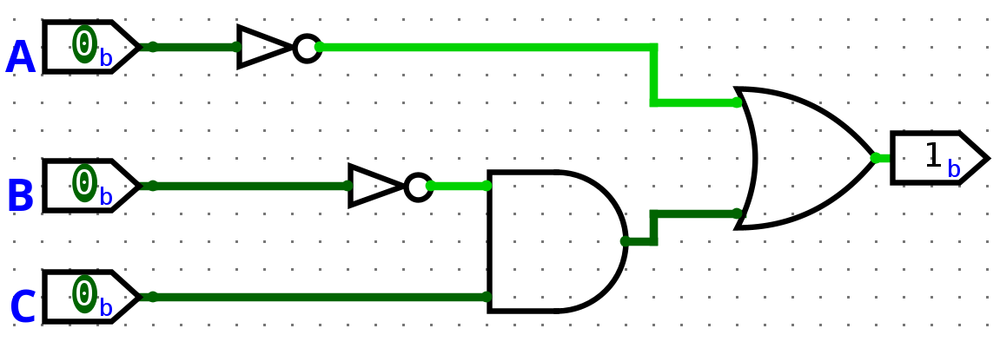
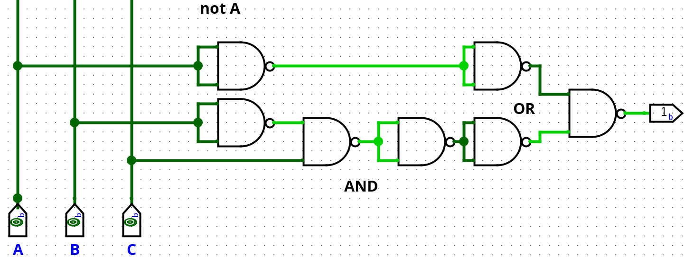
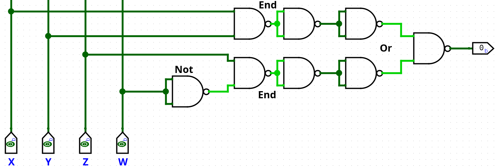
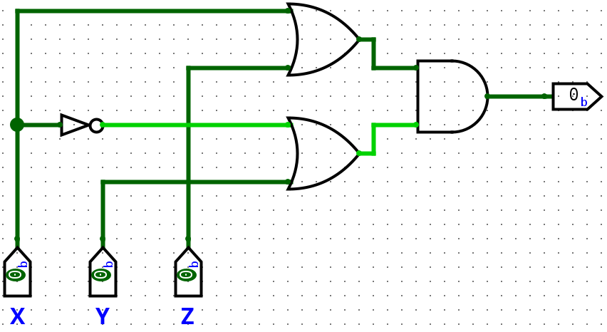
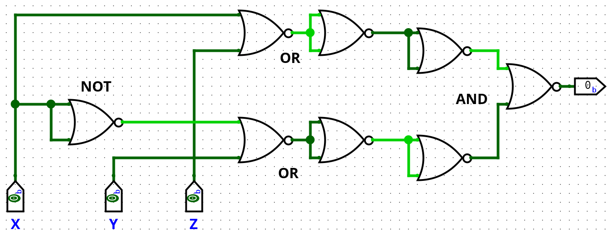

## Exercise 1: Minterm Simplification

### Problem

**Function:** F = Σ₃ m(1, 3, 5, 7)

This represents a Boolean function of **3 variables** (A, B, C) expressed as the **sum (OR) of minterms**:
- **Σ (Sigma)**: logical OR of the listed minterms  
- **m(i)**: minterm with index *i* (input combination where output = **1**)

**Truth Table:**

| A | B | C | F |
|---|---|---|---|
| 0 | 0 | 0 | 0 |
| 0 | 0 | 1 | 1 |
| 0 | 1 | 0 | 0 |
| 0 | 1 | 1 | 1 |
| 1 | 0 | 0 | 0 |
| 1 | 0 | 1 | 1 |
| 1 | 1 | 0 | 0 |
| 1 | 1 | 1 | 1 |

**Observation:** For all input combinations where **C = 1**, the output **F = 1**, regardless of A and B.

### Solution

**Minimal Boolean Expression:** F = C

**Circuit:**


---

## Exercise 2: Maxterm Simplification

### Problem

**Function:** F = Π₃ M(0, 3, 4, 5, 7)

This represents a Boolean function of **3 variables** (A, B, C) expressed as the **product (AND) of maxterms**:
- **Π (Pi)**: logical AND of the listed maxterms  
- **M(i)**: maxterm with index *i* (input combination where output = **0**)

**Truth Table:**

| A | B | C | F |
|---|---|---|---|
| 0 | 0 | 0 | 0 |
| 0 | 0 | 1 | 1 |
| 0 | 1 | 0 | 1 |
| 0 | 1 | 1 | 0 |
| 1 | 0 | 0 | 0 |
| 1 | 0 | 1 | 0 |
| 1 | 1 | 0 | 1 |
| 1 | 1 | 1 | 0 |

**Observation:** Rather than focus on maxterms, it's more intuitive to find where **F = 1**:
- (A, B, C) = (0, 0, 1)
- (A, B, C) = (0, 1, 0)
- (A, B, C) = (1, 1, 0)

### Solution

**Derivation:** Writing the Sum of Products from where F = 1:
- F = (!A · !B · C) + (!A · B · !C) + (A · B · !C)
- Factoring: F = (!A · !B · C) + (B · !C · (!A + A))
- Simplifying: F = (!A · !B · C) + (B · !C)

**Minimal Boolean Expression:** F = (!A · !B · C) + (B · !C)

**Circuit:**

---

## Exercise 3: Karnaugh Map Simplification (SOP)

### Problem

**Function:** f(x, y, z, w) with four variables

**Karnaugh Map:**

```
          zw
        00  01  11  10
      ┌────────────────
xy 00 │  0   1   1   0
   01 │  0   1   1   0
   11 │  1   1   0   0
   10 │  1   1   0   0
```

### Solution

**Karnaugh Grouping (SOP):**

- **Group 1 (Upper 2×2):** xy = {00, 01}, zw = {01, 11} → ¬x · w
- **Group 2 (Lower 2×2):** xy = {11, 10}, zw = {00, 01} → x · ¬z

**Minimal Boolean Expression:** f(x, y, z, w) = (¬x · w) + (x · ¬z)

**Circuit:**

---

## Exercise 4: NAND Gate Implementation

### Problem

**Karnaugh Map (3 variables: A, B, C):**

| C \ AB | 00 | 01 | 11 | 10 |
|------|----|----|----|----|
| 0    | 1  | 1  | 0  | 0  |
| 1    | 1  | 1  | 0  | 1  |

**Observations:** 
- Function is **1 for all cases where A = 0**
- Function is also **1 when B = 0 and C = 1**

### Solution

**Minimal Boolean Expression:** F = ¬A + (¬B · C)

**NAND Gate Transformations:**
- NOT X: X NAND X
- X AND Y: (X NAND Y) NAND (X NAND Y)
- X OR Y: (X NAND X) NAND (Y NAND Y)

**Circuits:**

Simplified logic diagram:


NAND-only implementation:

---

## Exercise 6: Four-Variable NAND Implementation

### Problem

**Karnaugh Map (4 variables: X, Y, Z, W):**

| ZW \ XY | 00 | 01 | 11 | 10 |
|--------|----|----|----|----|
| **00** | 0  | 0  | 1  | 0  |
| **01** | 0  | 0  | 1  | 0  |
| **11** | 0  | 0  | 1  | 0  |
| **10** | 1  | 1  | 1  | 1  |

### Solution

**Karnaugh Grouping:**
- **Group 1 (row ZW = 10):** Z = 1, W = 0 → **Z·¬W**
- **Group 2 (column XY = 11):** X = 1, Y = 1 → **X·Y**

**Minimal Boolean Expression:** F = Z·¬W + X·Y

**NAND-Only Circuit Implementation:**


## Exercise 7: Karnaugh Map Minimization and NOR Synthesis

Given the truth table, simplify the function using a Karnaugh map, obtain the minimal POS (Product Of Sums) expression, and implement the circuit using only NOR gates.

Truth Table

| X | Y | Z | F |
|---|---|---|---|
| 0 | 0 | 0 | 0 |
| 0 | 0 | 1 | 1 |
| 0 | 1 | 0 | 0 |
| 0 | 1 | 1 | 1 |
| 1 | 0 | 0 | 0 |
| 1 | 0 | 1 | 0 |
| 1 | 1 | 0 | 1 |
| 1 | 1 | 1 | 1 |

---

Karnaugh Map

| XY \ Z | 0 | 1 |
|--------|---|---|
| 00     | 0 | 1 |
| 01     | 0 | 1 |
| 11     | 1 | 1 |
| 10     | 0 | 0 |

---

### Grouping

We create the following groups:

1. Vertical group on column `Z = 1` for rows `00` and `01`
   - Common variable: `~X`
   - Resulting term: `(~X + Z)` in POS form

2. Horizontal group on row `XY = 11`
   - Common variables: `X` and `Y`
   - Resulting term: `(X + Y)` in POS form

---

### Minimal POS Expression

The minimal Product Of Sums expression is:



This is the simplified function obtained from the Karnaugh map.

---

### NOR Implementation

To implement the circuit using only NOR gates replace all AND/OR operations with equivalent NOR structures

The NOR synthesis still represents the same Boolean function:



So if your NOR circuit gives the same final expression, your implementation is correct.

