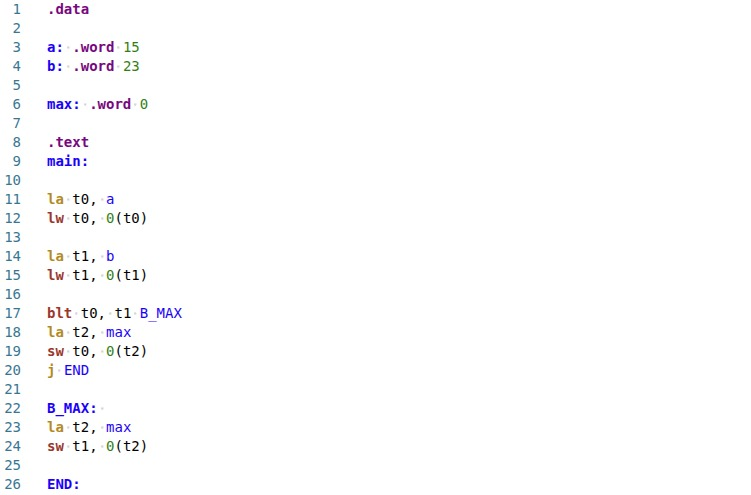
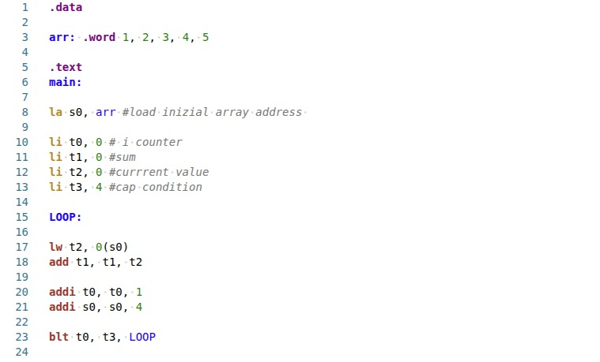

# RISC-V Exercises

> Note: These are solution-based exercises. Multiple correct implementations may exist.

---

## 000 — Find Max

Given two integers initialized in memory:
- `a = 15`
- `b = 23`

compute the maximum value between them and store it in `max`.

Solution image:

---

## 001 — Array Sum

Given an integer array initialized in memory:
- `arr = [1, 2, 3, 4, 5]`

compute the sum of all elements using a loop and store the result in a register.

Solution image:
